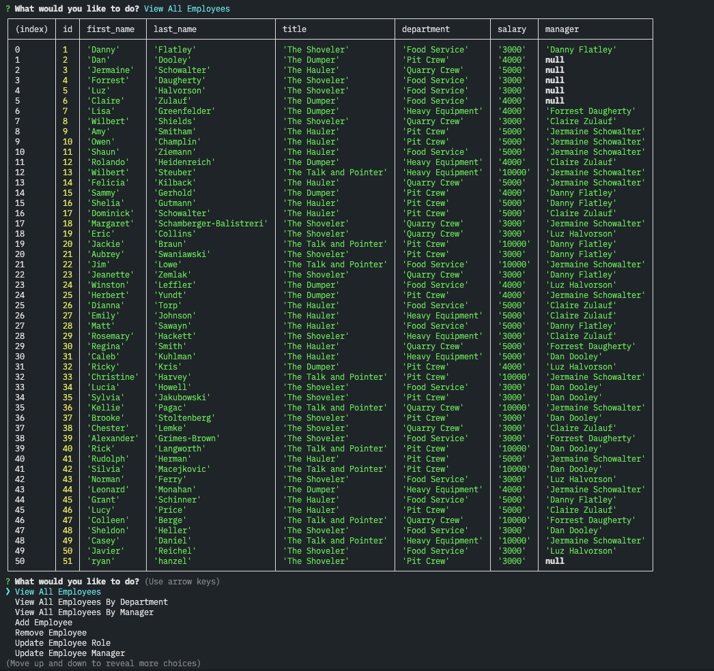
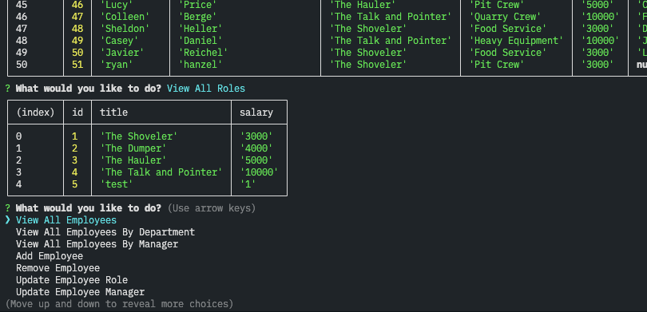
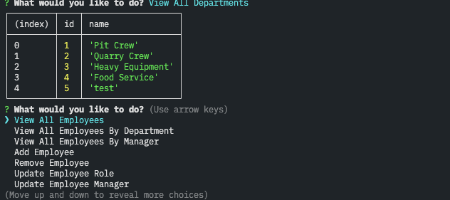

# Employee Tracker App

Ryan Hanzel

Bootcamp @ UT Austin | Module Twelve Assignment

## Description

This employee tracker app is a command line utility app that allows the user to view and manage different aspects of an organizations workforce through a MySQL database. The application utilizes Node along with several modules. 

The app allows you to:

- View all of the employees
- View all of the employees by department
- View all of the employees by manager
- Add an employee
- Remove an employee
- Update an employee's role
- Update an employee's manager
- View all roles
- Add a role
- Remove a Role
- View all departments
- Add a department
- Remove a department

## Links

[GitHub Repo](https://github.com/h3xivall/employee-tracker)

## Usage

To use the app start by:

- Clone the repo
- Move to the applications root folder in your console
- Type the command ```npm install``` to install the applications dependencies
- Ensure your local MySQL server is running
- Open the .envexample and fill in your local MySQL server information and save it as .env in the same folder
- Type the command ```npm start``` to run the application
- The initialization script will create, seed, and generate 50 employees for your MySQL database
- You will then be given a set of different options to:
  - View all employees: This will list all employees by id number
  - View all employees by department: This will list all employees by their department id
  - View all employees by Manager: This will list all employees by their manager's employee id
  - Add employee: This will add a new employee into the database
    - Enter employees first name
    - Enter employees last name
    - Select which department the employee will belong to
    - Select which role the employee will have
    - Select the employees manager
  - Remove employeee: This will allow you to list all of the employees by option and remove one from the database
  - Update employee role
    - This will list all employees as options to select
    - After selecting an employee the app will ask you to update their role
  - Update employee manager
    - This will list all of the employees as an option to select
    - After selecting the employee you will have an option to select a new manager from a list of available managers for the employee
  - View all roles: This option will view the different roles available
  - Add Role: This option will allow you to add a new role in the database
    - Enter the role name
    - Enter the role salary
  - Remove Role: This option will list the available roles to select for removal (Note: You are unable to remove any of the original roles)
  - View all departments: This option will list all of the available departments
  - Add department: This option will allow you to add a new department into the database
    - Enter department name to add the department
  - Remove department: This option will list the available departments you can select for removal (NOTE: you are not able to remove any of the initially seeded departments)
  - Exit: This option will terminate the operation of the application and exit to your current working directory

## Screenshots



